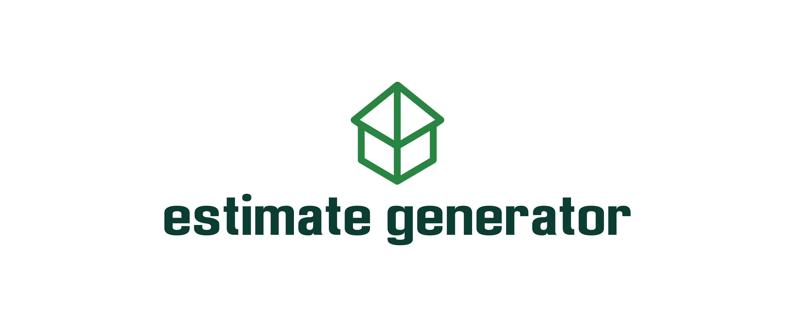
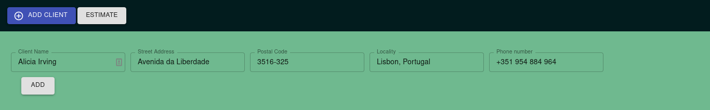
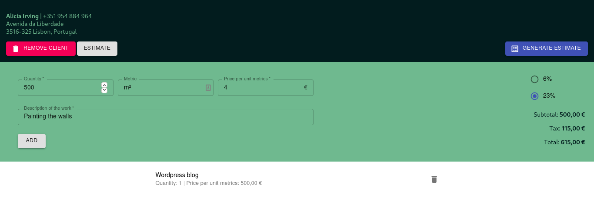
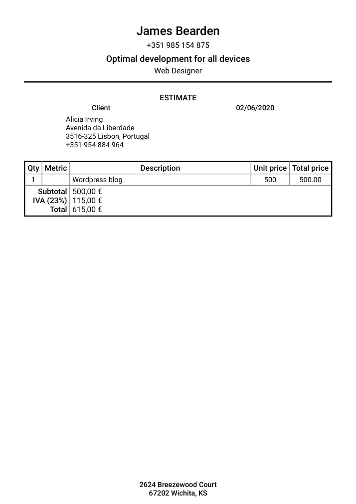

## Description

Easily generate estimates in PDF format for your clients, on the fly.<br />

## How to edit for personal use

Edit the object `mockWorker` in the file `/src/helpers/helpers.js` to use the appropriate name for the person who will use the application.<br/><br/>
To change the language of the output to your own (default is English), in `/src/helpers/helpers.js/` you will have a `generateEstimatePDF()` function, that contains the pdf template named as `estimatePDF`. Look for the words that appear in the final PDF template and change them to your language.<br/>
<br/>
To edit the tax value, in the file `/src/components/EstimateCostDisplay.js` edit the `<Radio>` components. <br/>
Example for a tax of 17% that becomes 0.17

```html
control={ <Radio checked={taxPercentage === 0.17} onChange={handleChange}
value="0.17" name="taxPercentage" color="primary" /> } label="17%"
```

You will also need to edit the file `/src/stores/estimateStore.js`, property `taxPercentage` to your desired one. Default is `0.23`, if you want 17% tax cut set it to `0.17`.

Now the application is ready to go!

## Available Scripts

In the project directory, you can run:

### `yarn start`

Starts the application (react + electron) in development mode.

### `yarn electron-build`

Builds the entire application for production (react + electron) with the current using operating system in mind. Apply different tags for specific builds.

- `yarn build-windows`: for a windows build
- `yarn build-linux`: for a linux build
- `yarn build-mac`: for a mac build

### `yarn electron-build`

Builds ONLY the electron part of the application for production with the current using operating system in mind. Apply different tags for specific builds.

- `yarn electron-build-windows`: for a windows build
- `yarn electron-build-linux`: for a linux build
- `yarn electron-build-mac`: for a mac build

### `yarn react-start`

Runs the app in the development mode.<br />
Open [http://localhost:3000](http://localhost:3000) to view it in the browser.

The page will reload if you make edits.<br />
You will also see any lint errors in the console.

### `yarn react-build`

Builds the app for production to the `build` folder.<br />
It correctly bundles React in production mode and optimizes the build for the best performance.

The build is minified and the filenames include the hashes.<br />
Your app is ready to be deployed!

See the section about [deployment](https://facebook.github.io/create-react-app/docs/deployment) for more information.

### `yarn eject`

**Note: this is a one-way operation. Once you `eject`, you can’t go back!**

If you aren’t satisfied with the build tool and configuration choices, you can `eject` at any time. This command will remove the single build dependency from your project. It will copy all the configuration files and the transitive dependencies (webpack, Babel, ESLint, etc) right into your project so you have full control over them.

## Examples

<p align="center"><a href="usage-examples/add-client.png"></a></p>

<br/><br/>
<p align="center"><a href="usage-examples/add-estimate-item.png"> </a></p>

<br/><br/>

<p align="center">
<a href="usage-examples/pdf-estimate-final-result.png">
</a></p>

## How to edit the PDF template

In the file `/src/helpers/helpers.js` you will have a `generateEstimatePDF()` function, that contains the pdf template named as `estimatePDF`.<br/> You can tinker the PDF template to your own liking here. Check this [documentation](https://pdfmake.github.io/docs/) and this [playground](http://pdfmake.org/playground.html) to learn how to do it.

## Create React App

This project was bootstrapped with [Create React App](https://github.com/facebook/create-react-app). You can learn more in the [Create React App documentation](https://facebook.github.io/create-react-app/docs/getting-started).

### License

Estimate Generator is [MIT licensed](./LICENSE).
